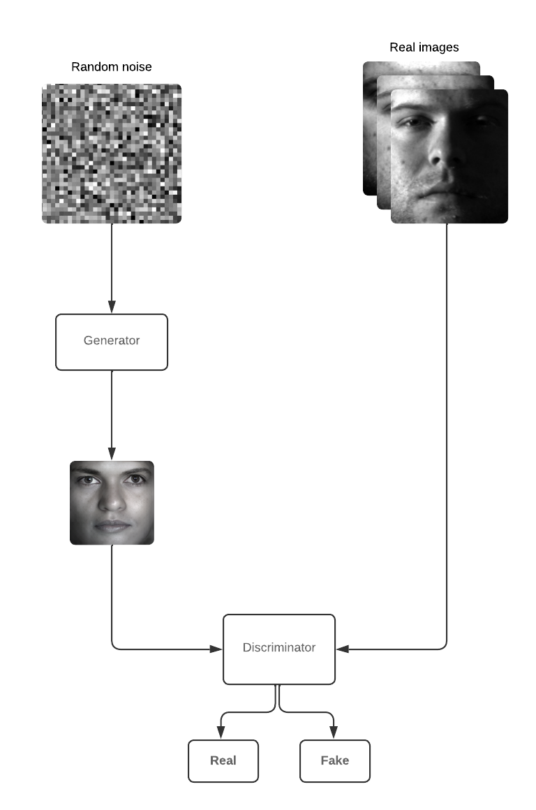
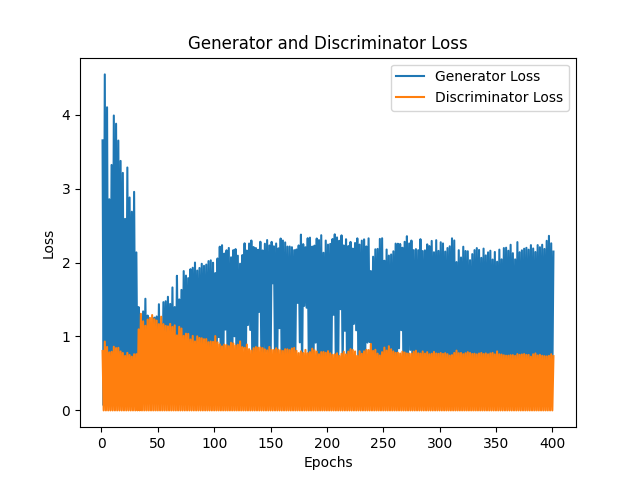
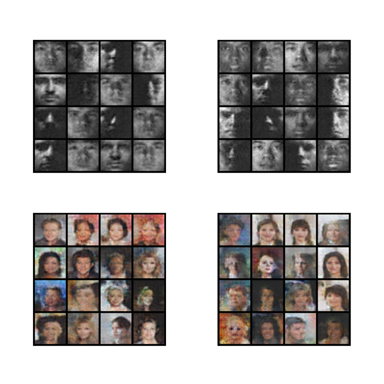

# GAN-face-generator

## How it works?

Generative Adversarial Networks (GANs) are a class of machine learning models designed to generate new data that mimics a given dataset. Consist of two neural networks: a generator and a discriminator. The generator improves by receiving feedback from the discriminator on how "realistic" the synthetic data looks, while the discriminator becomes more skilled at distinguishing real from fake data. Through this adversarial process, the generator learns to produce increasingly realistic outputs.

## Diagram

## U-Net Architecture

* **Contracting path (Encoder)** - series of convolutional and down-sampling layers. Compresses the image to a lower-dimensional feature space.
* **Expanding path (Decoder)** - series of transposed convolutions (up-sampling). Includes skip connections between corresponding layers of the encoder and decoder.

## Training and effects

In my GAN project, I trained the model using two distinct datasets.
* Extended Yale Face Database B - [click](http://cvc.cs.yale.edu/cvc/projects/yalefacesB/yalefacesB.html)
* CelebA Dataset - [click](https://www.kaggle.com/datasets/jessicali9530/celeba-dataset)

